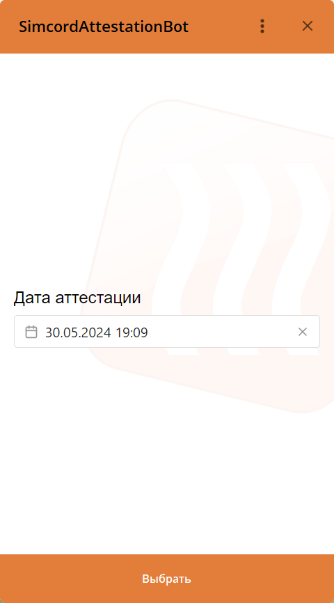
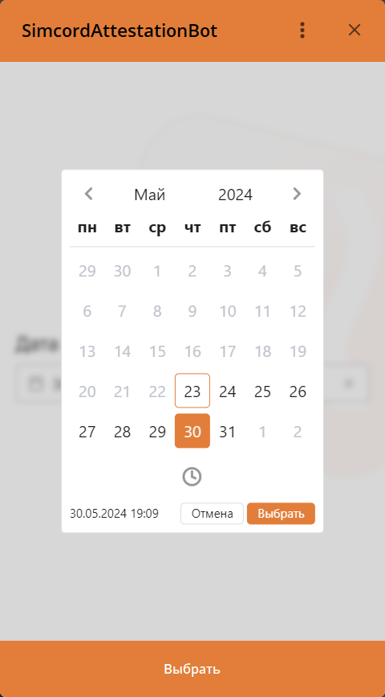

# Simcord Attestation Web

<div style="text-align: center;display: flex; flex-direction: row; justify-content: center; gap: 10px">


</div>

<br/>
<br/>
<br/>
<br/>

## Project setup

```
npm install
```

### Compiles and hot-reloads for development

```
npm run serve
```

### Compiles and minifies for production

```
npm run build
```

### Lints and fixes files

```
npm run lint
```
<br/>
### Customize configuration

All configuration can be setup vie web-site query params:

| Name        |               Default | Range/Type                     | Description                                      |
|-------------|----------------------:|--------------------------------|--------------------------------------------------|
| max         |                       | iso-string?                    | All dates after the given date will be disabled  |
| min         | start of current date | iso-string                     | All dates before the given date will be disabled |
| placeholder |                       | string?                        | Input placeholder                                |
| label       |                       | string?                        | Input label                                      |
| format      |            'datetime' | 'date' \| 'time' \| 'datetime' | Format of selected value                         |


#### Dev

[Test web site](https://benevolent-starship-f1a57d.netlify.app/)